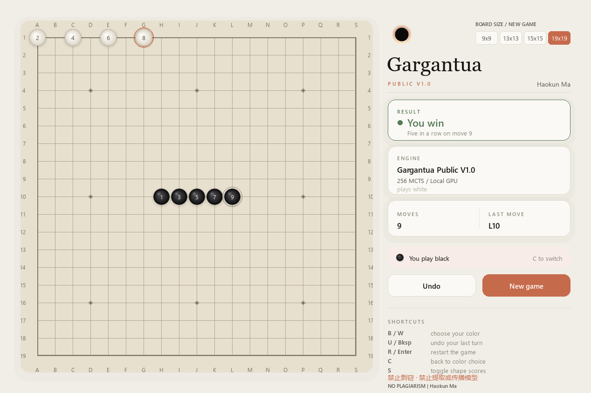

# Garguantua Gomoku

**Gargantua Public V1.0 · Author: Haokun Ma**

离线五子棋 AI 的 Windows 发行仓库。此仓库提供程序下载与使用说明。

## 下载与运行

从 [最新发行版](https://github.com/TommyMaHaoKun/Garguantua-Gomoku/releases/latest) 下载 `Gargantua Public V1.0-Windows-x64.zip`，
解压后双击 `Gargantua Public V1.0.exe`。

- Windows 10 / 11，64 位 x64；不需要安装 Python、CUDA，也不需要账号或联网激活。
- 自动检测支持的 GPU 并用于模型推理；无法使用或执行出错时回退 CPU。
- 侧边栏显示当前使用的 GPU / CPU。
- 可选 9×9、13×13、15×15、19×19 棋盘。切换大小会保存并结束当前对局。
- 胜负显示在侧边栏，棋盘始终完整可见。

U / Backspace：悔棋；R / Enter：重开；C：切换执子；S：显示评分。
更多信息见 [使用说明](README.txt)。

## 验证与兼容性

发行程序已在 RTX 5060 Laptop GPU 上验证 GPU 和 CPU 两种模式，覆盖四种棋盘大小。
其他显卡依启动时的实际检测结果决定，尚未逐一实机验证。
原模型训练尺寸为 19×19；小棋盘没有单独训练，不应认为棋力相同。
此版本尚无数字签名。

## 作者与使用范围

**Haokun Ma · 禁止剽窃 / NO PLAGIARISM**

允许按随附声明运行软件和原样转发完整发行包。禁止冒充原创作者、删除署名，
以及未经许可提取、传播或出售模型权重。“Public”表示公开发行，不表示模型开源或公有领域。
详细条款见 [禁止剽窃声明](禁止剽窃-NOTICE.txt)；第三方组件保留其各自许可证授予的权利，见 [licenses](licenses)。

离线保护只能提高提取成本，不能保证模型永不被提取。
